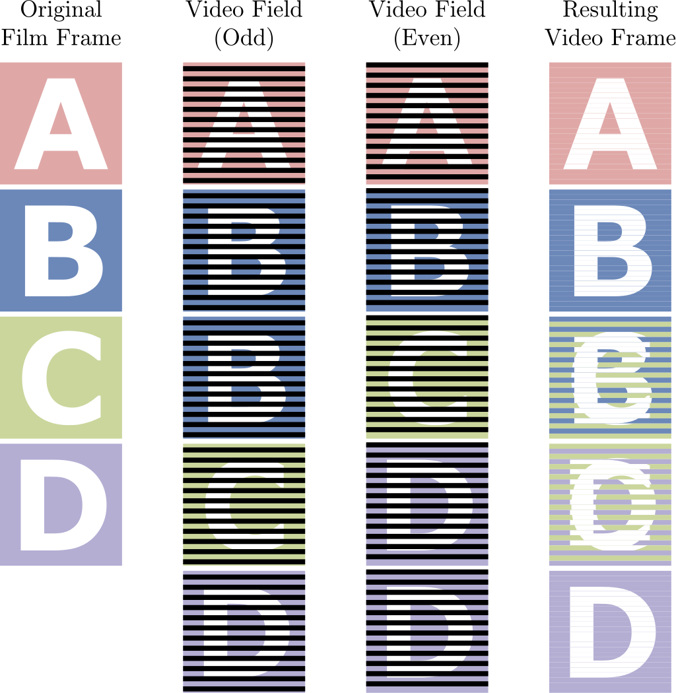

# A Primer on Telecining

When working on DVDs,
you will no doubt come across a fairly annoying artifact:
combing.

Virtually every DVD has these,
and in some cases  you may even find them on Blu-rays!

What you're seeing here is called *telecining*.
It's very common for digital anime to be produced at a constant 23.976 frame/s
However, old analog TVs would always broadcast video at 29.97 frame/s.
This became a problem for anything that wasn't that exact framerate,
such as a lot of movies and TV series,
and, indeed, most anime.

## Telecining Patterns

In order to fit within that constraint,
telecining patterns were conceived.
For regular anime framerates,
there are four frames of the original animation (also known as FILM)
for every five frames of 29.97 frame/s video,
as shown with the following simple equation:

$$
\frac{23.976}{29.97} = \frac{4}{5}
$$

To deal with this,
many studios have been exploiting the interlaced nature of 60Hz video.
In interlaced video,
every frame is split up into two incomplete images,
also known as *fields*.
Each field takes up either the even or odd rows of a frame.
By abusing how this works,
studios have been able to fit 23.976 video into 29.97
by splitting each frame up into fields and duplicating them as necessary.

To achieve a clean 23.976 → 29.97 frame/s conversion,
4 frames must be represented as 10 fields.
This is done by duplicating fields following a set pattern.
Assuming each frame in a cycle is labelled alphabetically,
you get frames A, B, C, and D.
When telecining,
the fields of these frames will often alternate like so:

$$
\frac{A - A - B -  B -  B -  C -  C -  D - D - D}{2 - 3 - 2 -3}
$$

This telecining operation is called *3:2 pulldown*,
and is the most common form of telecining there is for anime.

Other forms of pulldown exist,
but those are rarely used in any kind of video source
you'll end up using when encoding anime.
The only exception may be PAL DVDs,
but due to the nature of trying to fit 23.976 → 25 being so difficult,
these will often be a lot harder to undo
(and more crucially,
Wobbly does not currently offer support for these kinds of patterns).

## Telecining vs. Interlacing

Interlacing and telecining are often mixed up in common vernecular.
However, it's very important to understand the differences between the two prior to filtering,
and to be able to diagnose which frames make use of which.

*Interlacing* is,
in essence, the combing-like artifact you see,
even with telecining.
The difference is that with a fully interlaced video,
*there are no fields to match together*.
Every field is unique,
so the proper way to handle these is to deinterlace them
and double the temporal resolution.

*Telecining* follows a predictable pattern
and is used to convert a lower framerate into a higher one
(using for example the aforementioned 3:2 pulldown).
Certain frames may be interlaced,
but you are not required to deinterlace them.
Because the video was originally of a lower framerate
and a consistent pattern has been applied to increase it,
the original frames can be nigh-losslessly restored.

When deinterlacing,
what you're doing is splitting up the video frames into fields
and interpolating them up into full frames.
Every field is half the vertical resolution of the video,
so when deinterlacing a frame you're effectively throwing out half the vertical resolution
and trying to recreate what it may have looked like.
With telecined content,
this does more harm than trying to reconstruct the original frames by matching the fields
and is thus not preferable
unless you're dealing with post-processing that broke the pattern.

## Cycles and Pattern Breaking

When Inverse Telecining (also known as IVTC),
it helps a lot to think of the video in terms of *cycles*.
Within a telecined 29.97 frame/s video,
assuming the source video is 23.976 frame/s,
each cycle will be *five* frames long.
Post-IVTC, that cycle must be reduced to *four* frames.

However, patterns will often break in anime,
as it's not uncommon for studios to be editing 60i footage directly.
This means that any splices made during that process may result in the cycle being broken,
and will result in *orphan fields* being created.

*Orphan fields* are fields with no pairing field available to reconstruct the original frame with.
They're an artifact leftover from improper splicing and trimming,
and can by nature no longer be losslessly restored.
The most common method to handle those is to duplicate the previous frame.
This, however, has the drawback of creating a small "hiccup" during playback
if the scene has a lot of motion prior to the scenechange.

## 60i and Variable Framerate Footage

In the early digital era,
a lot of studios were still experimenting with digital tooling.
This included working directly on 60i video,
as well as mixing different framerates together.

A common example of editing done on 60i video is *interlaced credits*.
When checking each individual field,
sometimes you may notice that certain elements are unique in each field.
These are *hard-interlaced*,
and must be deinterlaced.
This may not always be straight-forward however,
as with for example interlaced credits, the underlying video is still 23.976 frame/s content,
and deinterlacing may cause a lot of damage to it.
There's various different ways to handle deinterlacing such content,
and the most common cases will be handled on their own pages.

In some rarer instances,
certain animations or effects may also be animated at 29.97 frame/s.
These will often play back completely fine on 60i video,
and appear progressive.
This may also extend to certain effects such as panning shots,
zooms, background animations,
or even video effects or CGI elements.
In order to properly preserve those,
you must output a Variable Framerate (VFR) clip
or store frame time information in an external file
and mux those into the video container after encoding.
This means the scenes that are telecined must be marked as 23.976 frame/s post-IVTC,
and the scenes that are animated at 29.97 frame/s must be marked as 29.97 frame/s.
Any deinterlaced scenes where the temporal resolution has been increased
must be marked as 59.94 frame/s.

## Additional Learning Resources:

* [Telecine - Wikipedia](https://en.wikipedia.org/wiki/Telecine)
* [CD / Frame Rate - Youtube](https://www.youtube.com/watch?v=DyqjTZHRdRs)
* [CD / Interlacing - Youtube](https://www.youtube.com/watch?v=5eu_KjKsnpM)
