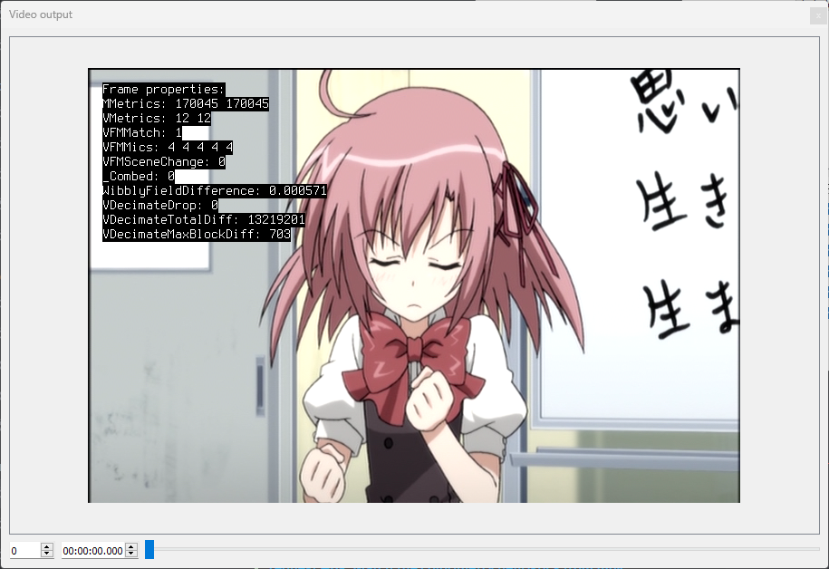

# Indexing with Wibbly

For Wobbly to do its job,
you first need to create a JSON file for it to read and write to.
This file should contain source information,
trims,
matches,
and many other metrics.
This is where Wibbly comes in.
Wibbly will run over a given file
and gather the necessary metrics
for wobbly to work properly.

## Loading Videos

Wibbly consists of two main windows:

- The jobs window
- The video output window

The main jobs window is where you create metric collecting "jobs".
You can drag video and specific indexing files into this window,
and by clicking on them
you can choose which metric gathering operations you'd like to perform.

You also open up different windows from this main window.
It's recommended you select every window
so you can easily adjust settings on the fly.
The state and geometry get stored in an ini file
and will persist when you open up wibbly again next time.

The video output shows a very simple output of the given video file.
You can framestep or jump to a specific frame or time.
When you first open up Wibbly,
this window will be empty.
To load a video,
we first need to drag a video file into the jobs window.

Wibbly accepts the following inputs:

- Common video formats BestSource can read (such as m2ts, mkv, etc.)
- dgi index files
- d2v index files

Note that, if you use BestSource, your source file must be remuxed to MKV format.

Take note!
If DGIndex reports that your source is (almost) 100% FILM,
you do not want to use Wobbly on it!
*FILM* denotes how much of the indexed clip is *soft-telecined*.
If the entire clip is FILM,
there is no reason to perform any IVTC on it
and instead you should simply ignore the flag.

## Gathering Metrics

Once you've indexed a video file,
the video will show in the Video Output window.

Before you begin,
it's a good idea to double-click on the current job inside the Jobs window
to ensure it properly applies any settings you set to the Job.
The first two things you want to do
is trim and crop the video as necessary.

When trimming,
be aware that the trims are *inclusive*.
This means that if you trim frames 0–100,
frame 100 will be included in the trimmed clip.
If you're working with TV caps,
you'll want to make sure you trim out only the actual episode
and ignore all the sponsorcards and advertisements.
With DVDs,
you may have indexed multiple episodes at once.
Trim out only the episode you want to work on,
and ignore the others.
If you want to work on the other episodes,
make sure you give each output file a unique name
so you don't accidentally overwrite them with the next metrics gathering!

Cropping is done to get rid of the black bars on the sides of the video.
Keeping those may mess with the metric gathering,
so it's safer to remove them.
With YUV420 video,
the final output image must be mod4 vertically and mod2 horizontally,
so you may need to crop slightly more
to get rid of all the black bars.
The Video Output window will update as you select crops,
so you can see whether a crop is being applied properly immediately.

Next,
you select the threshold for interlaced fades detection.
Interlaced fades are fading effects applied to a video
that was telecined to 29.97 frame/s.
These fades will be 29.97 or 59.94 frame/s,
but the underlying animation will often be 23.976 frame/s,
so we must pull them down.
To determine a healthy threshold,
locate an interlaced fade in your video
and adjust the threshold until it catches the entire fade.
Don't make the threshold too low,
or else it may catch non-fades by accident!

Finally,
you want to select the metrics to gather.
These can be selected in the VFM window.
You can leave most of these settings alone,
but make sure you *always* tick "Enable DMetrics".
If your video is Bottom-Field-First,
set "order" to "0".
Furthermore,
if your source has chroma with a different telecining pattern,
ghosting,
blending,
etc.,
untick "Chroma" in this menu as well.

## Running Your Jobs

Once you've set all the settings
and prepared your jobs as best you can,
it's time to execute them.
In the Jobs window,
you can select which operations to perform per job.
To switch jobs,
simply click on the job you want to change settings for
inside the Jobs window.

It's recommended you gather metrics for every single option available.
Exceptions may be trimming or cropping if they're not performed,
or interlaced fades if you are absolutely certain there are none.
If you have a source that is almost certainly a constant pattern as well
(such as TV caps for example),
you may also skip metrics such as scene detection,
decimation,
and interlaced fades.
This may speed up the metric gathering a bit,
but it's still safer to check for everything.

Once you've made your choices
and made sure everything is correct,
click on the "Engage" button.
A new window will pop up
and show the estimated time until each job is done.

Once this is done,
you will have a "wob" file
in the location you've told it to save it
(by default next to the source file).
This file is simply a JSON file
and contains all the metrics Wibbly has gathered for you.
These will be read and modified by Wobbly.
