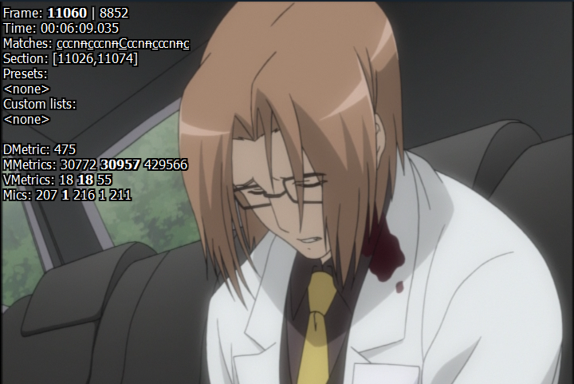
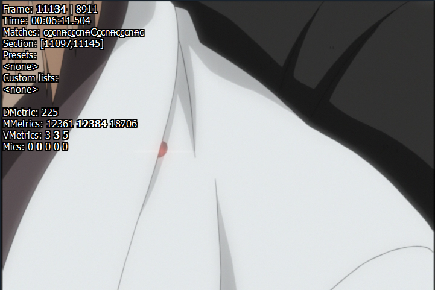
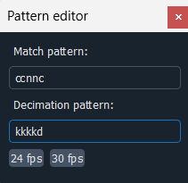

# Crossfades

Crossfades are a particularly difficult task to handle when IVTCing.
For most crossfades, every frame can be fieldmatched. But for
others, deinterlacing is necessary.
This guide will explain how to handle the fieldmatchable crossfades
and will give some information regarding the non-fieldmatchable
ones.

## The different types of crossfades

When telecined footage is crossfaded, you have two cuts (pieces of
footage) on screen at once, and those respective cuts often have
different match and decimation patterns.
There are 3 classes of crossfades: fades where the patterns are the
same, fades where the patterns are off by one, and fades where the
patterns are off by two. Each type should be handled differently.

Let's call the first piece of footage in the crossfade Cut A and the
second piece Cut B. Cut A is fading out, and Cut B is fading in.

We need to check where the CCCNN pattern of each cut starts, take
the mod5 value of that, and compare the two values.
Or to put it another way, we need to look at which of frames 0-4 the 
patterns start on.
So for example, if Cut A's CCCNN pattern starts on a frame ending in
1 and Cut B's pattern starts on a frame ending in 2, the patterns are
one frame apart.
If the patterns start on 4 and 1, respectively, the patterns are two frames apart (since `(4+2) mod 5 = 1`).



This cut's CCCNN pattern starts on frame 11060, which ends in 0...



...and this cut's CCCNN pattern starts on frame 11134, which ends in 4. So the patterns are 1 frame apart, since `(4 + 1) mod 5 = 0`.
To be clear, you can pick any frame where the CCCNN pattern starts
when doing this check.

## Telecined crossfades: same pattern

If the patterns of each part of the fade are the same, there's no
need to do anything special.
You can handle the fade just like any other scene.
In fact, you may not even notice that a crossfade exists when
IVTCing.
There will be faint combing during the fade due to each field being
slightly more progressed in the fade than the previous one.
This combing can be handled using vinverse.

```
Cut A pattern:            CCCNN
Cut B pattern:            CCCNN
The match you should use: CCCNN
```
Very straightforward.

## Telecined crossfades: patterns are off by one

If the patterns of Cut A and Cut B are off by one, you can still
fieldmatch every frame.
But you can't do so just by hitting ctrl-s until there's no combing
anymore.
Instead, what you want to do is fieldmatch four out of the five
frames in the pattern and then decimate the non-fieldmatchable
frame away.
It's not totally intuitive why this is possible. After all, the
patterns look like this:
```
Cut A pattern:            CCCNN
Cut B pattern:            NCCCN
The match you should use: ?CC?N
```
It appears that there are two frames in the pattern that will be
wrong no matter what match you choose, meaning that our "decimate
the combing away" strategy won't work.
However, that's not the case, since in any CCCNN pattern, the last
C match can also be an N match if need be.
So using e to indicate frames where either match is OK, we have this:
```
Cut A pattern:            CCeNN
Cut B pattern:            NCCeN
The match you should use: ?CCNN
```
Or if the patterns are offset in the other direction:
```
Cut A pattern:            CCeNN
Cut B pattern:            CeNNC
The match you should use: CCNN?
```
So if you use the pattern editor to set a CCNNX pattern (where X
is whatever you want) and set the decimation pattern to decimate
the last frame, now you can press ctrl-s until the only combing
is on frames that are getting decimated away.
Technically, you don't need to set section barriers on either
side of the crossfade before doing this. You can apply this pattern
to the crossfade and the scene before and after it.



## Telecined crossfades: patterns are off by two

Now things get tricky.
I'll say up front that there is no correct way to handle these
crossfades in wobbly.
This guide will be updated if/when such a method is developed
and put into practice.
The following is just for informational purposes and will not
provide a recommendation of what you should do in an encode.

If the patterns of each cut are offset by two, there is no way to
decimate away the problematic frames:
```
Cut A pattern:            CCeNN
Cut B pattern:            NNCCe
The match you should use: ??C?N
```
Instead, we have to use a deinterlacer like qtgmc.

(Note that the content of the cuts can affect the above statement.
As a trivial example, if Cut B is completely static during the
crossfade, then all of Cut B's frames become `e` frames—both `C` and
`N` matches become okay for the entire fade—and we can just set the
pattern to whatever Cut A uses.)

Can we qtgmc at 30fps and decimate? No we cannot.
To verify, find a crossfade where both pans are fades/zooms and
look at the output closely—one or both of the cuts will have
jittery motion.
Instead, we need to deinterlace with qtgmc at 60 fps and, from that
output, pick the correct 4 frames from every 10-frame cycle.
Ideally, we would then splice in any fieldmatchable frames.

This is obviously a complicated thing to do, let alone in wobbly.
There is no tooling to do it in any reasonably efficient fashion.
