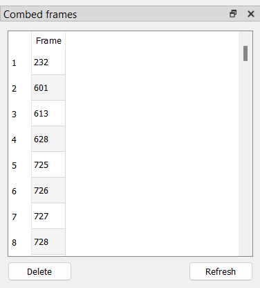
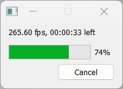

# Handling Pattern Guessing Failures

After pattern guessing,
there may still be pattern guessing failures.

Useful keybinds for this section:

| Key                       | Action                                   |
| ------------------------- | ---------------------------------------- |
| Left Arrow                | Jump 1 frame back |
| Right Arrow               | Jump 1 frame forward |
| S                         | Cycle the current frame's match |
| D                         | Toggle decimation for the current frame |
| Ctrl + F                  | Replace current frame with previous frame (freezeframe) |
| Shift + F                 | Replace current frame with next frame (freezeframe) |

## Fixing the Failures

There are two kinds of pattern guessing failures:

- Section too short

The section is too short for the guessing method.
This is defined by the "Minimum length" setting.
To fix this,
double-click on the failed pattern guess in the list,
adjust the section so it's larger than or equal to the minimum length,
and then click "Process current section".
If you did this properly,
it should remve the section from the list.

- Ambiguous pattern

Indicates that Wobbly was unable to find the correct pattern.
There can be multiple reasons behind this,
but it most often means that you either did not set your section correctly,
or that section can not be IVTC'd properly.

For every ambiguous pattern,
you'll want to manually fix the pattern.
You can do this by double-clicking the failed guess in the list,
and then cycle through the pattern using `Ctrl + S` by default.
Note that this won't remove the section from the list.

If you have a section that you are sure is 29.97 frame/s,
you can adjust the pattern in the "Pattern editor" window.
Set it to *30 fps* and press `Ctrl + S`.
You'll also want to apply this to any scene that requires specific post-filtering in your script.
This can be for example 59.94 frame/s credits on top of 23.976 frame/s video
(which is very common for Opening and Ending themes),
or scenes you can't match properly
and must be pulled down to 23.976 frame/s.
**Make sure you set it back to *24 fps*
after you've dealt with every known 29.97 frame/s scene!**

## Leftover Combing

Pattern guessing may sometimes leave you with random combed frames
that could not be matched automatically.
Open the "Combed frames" menu.

Before you do anything,
click "Refresh".
This will perform another search through the clip
to find any remaining combed frames.
This may take a couple of minutes to finish.

You can now double-click on all the found combed frames,
or jump to the next combed frame using .
For any combed frame,
you can press `S` to cycle through fieldhints.
If every cycle returns a combed frames,
consider adjusting the decimated frame
(using `D` to swap between decimated and not,
making sure you don't ruin the framerates you just fixed),
or pulling it down in your filterchain later.

Another thing to take into account is that this will also find telecined fades.
You typically do not want to perform fieldmatching on the fade itself,
but just the underlying animation.
If the caught combed frame is caused by the fade,
ignore it
and process it with a filter meant to deal with those
in your filterchain later.

## Freezeframing

If you find scenes of a duplicated clip
(that was not decimated due to being animated on twos/threes/fours)
that has very heavy compression artifacting,
it might be worth it to freezeframe it with either the next frame
(`Shift + F`)
or the previous frame
(`Ctrl + F`).
You can adjust these later in the "Frozen frames" window.
This usually won't be applicable or worth it
unless you're dealing with *very* starved video
and heavy MPEG2 blocking.

## Crossfades

When dealing with fades to and from scenes,
you'll want to put the scene change somewhere in the middle.
The first frame before a fade in is usually the best,
unless it fades in from a solid colour with a clear scenechange.
To deal with crossfades
(that is, two scenes that fade into each other
without a solid color inbetween)
where the pattern differs between scenes,
you can try creating a new section
that captures just the fade.
Wobbly may be able to accurately decimate that for you.
If the pattern remains the same,
there is no reason to do this.

## Scenes that are likely to silently fail

Wobbly is reliant on the metrics it is fed,
and those metrics do not always perform well in scenes
with low-contrast combing or with a very slow pan/zoom.
And example of the former scene is a scene with rain and no other animation.
Depending on what pattern guessing method you used,
Wobbly may not mark these types of scenes as having an ambiguous pattern,
meaning that they will fail silently and you will not know
that there is a problem that you need to fix.
These scenes also usually cannot be caught by looking at combed frames,
high-mic frames, or frames with high dmetrics.
There is no solution to this other than to pay close
attention to those types of scenes when you are QCing your encode.
You need to understand the metrics being used
and use that knowledge to predict failure.
Looking at the metrics in the overlay can assist your understanding.