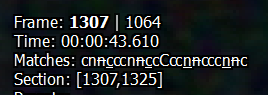
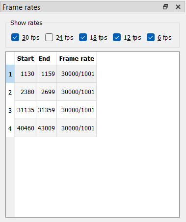

# Fixing Framerate Failures

A list of useful keybinds for this section:

| Key                       | Action                                   |
| ------------------------- | ---------------------------------------- |
| Left Arrow                | Jump 1 frame back |
| Right Arrow               | Jump 1 frame forward |
| D                         | Toggle decimation for the current frame |

Now that you've made most of your matches,
navigate to the "Frame rates" window.
It's easiest to go one frame rate at a time.
First,
select the "30p" checkbox.

### Handling 30p Scenes

29.97 frame/s framerates can show up for a couple reasons:

- You set a section to 29.97 frame/s yourself

This should be done on any scenes that are native 29.97 frame/s or 59.94 frame/s,
or requires pulldown of some kind
(overlaid 29.97 frame/s credits on 23.976 frame/s content, for example).

- Pattern changes on scenechanges leave you with an extra frame

This is not an uncommon occurrence,
as with anime the editing is often done on the telecined video.
The easiest fix for this is to simply decimate one of the extra frames.
This ensures you keep a constant frame rate.
This option is especially easy to take if the final frame in a section has an orphan field,
as the easiest way to fix those is to drop it anyway.
Another option is to keep that section 29.97 frame/s,
though you may cause desyncs during timing/subtitle syncing with other subtitles this way.

Whichever option you choose,
it pays dividends to be consistent.
One such consistency you can take
is to always drop the frame with an orphan field if possible
(these will almost always be marked as *B* matches,
so they're easy to spot),
and otherwise,
drop the frame before a scene change if there is one.
This is especially useful when IVTCing recurring clips,
such as Opening or Ending themes,
midcards,
etc.

### Handling 18p Scenes

Once you have fixed all the wrong *30p* sections,
we move on to *18p*.
*18p* is basically always going to be incorrect.
As such,
there should be 0 instances of *18p* cycles left
once you're done with IVTCing.

Usually 18p scenes happen because of awkward pattern changes across scenes
(or if you're unlucky,
within the same scene),
or because an orphan field gets dropped which breaks the framerate.
This means that in certain situations,
you may be forced to restore a duplicated frame
to ensure you still have a consistent framerate.
This is why it's recommended you apply the same consistency rule as with 30p scenes,
but some of it in reverse.
You restore orphan fields if possible,
but at scenechanges,
you restore the first frame of a scene if necessary
(unless one scene has a pan and the other does not).
This is because a "stutter" at the end of a scene is easier to spot
than a stutter at the very start of a scene.
If the 18p cycle occurs elsewhere,
use your best judgment.
Generally speaking,
you can't really go wrong if it's for example in the middle of a scene.

### Handling 12p and 6p Scenes

12p and 6p,
simply put,
only occur when you've made a mistake with manual decimations.
You can simply fix them and then handle them as you would 18p framerates
once you restore enough frames.

By the end of this,
you should have a list of 29.97 frame/s scenes
you manually and knowingly set this way.

