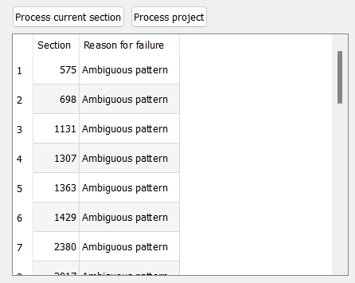

# Using Wobbly

Wobbly's job is to act as a GUI to easily adjust fieldmatches.
It makes use of the metrics collected by Wibbly to prepare a clip,
and can process those to IVTC a clip.

To get started,
grab the "wob" JSON file you generated using Wibbly
(or any other metrics gathering tool designed for wobbly)
and drag it into the Wobbly window.

## Familiarizing Yourself with the UI

Wobbly can be a bit difficult to work around for beginners.
This is because it's primarily built to work with *keybinds*.
This is a lot faster than pressing a button on-screen for every single operation,
and considering how many actions you must perform,
this will save you a lot of time and effort.

A list of keybinds can be found under the *Settings* tab.

Here is a quick table containing the relevant keybinds:

| Key                       | Action                                   |
| ------------------------- | ---------------------------------------- |
| Left Arrow                | Jump 1 frame back |
| Right Arrow               | Jump 1 frame forward |
| Ctrl + Up Arrow           | Jump to next section |
| Ctrl + Down Arrow         | Jump to previous section |
| Ctrl + Shift + Up Arrow   | Jump to next frame with high mic |
| Ctrl + Shift + Down Arrow | Jump to previous frame with high mic |
| Up Arrow                  | Jump to next frame with high dmetrics |
| Down Arrow                | Jump to previous frame with high dmetrics |
| Shift + Up Arrow          | Jump to the next combed frame |
| Shift + Down Arrow        | Jump to the previous combed frame |
| I                         | Start new section at current frame |
| Ctrl + Q                  | Delete current section |
| S                         | Cycle the current frame's match |
| Ctrl + S                  | Cycle through different patterns for the current section |
| D                         | Toggle decimation for the current frame |
| G                         | Jump to a specific frame (opens submenu) |
| Ctrl + F                  | Replace current frame with previous frame (freezeframe) |
| Shift + F                 | Replace current frame with next frame (freezeframe) |
| Ctrl + Z                  | Undo |
| Ctrl + Y                  | Redo |
| F5                        | Toggle preview mode (Source ↔ Preview) |
| Ctrl + Num + +            | Zoom in |
| Ctrl + Num + -            | Zoom out |
| (Not bound by default)    | Save Project |

These will be the shortcuts you'll use most,
so the sooner you can familiarize yourself with them,
the better.
You can always adjust them in this menu to your liking.

Make sure you don't accidentally spam Ctrl + S to save the project!
This is by default bound to "Cycle through different patterns for the current section".
It may be worthwhile to replace this keybind
if you're scared you'll accidentally cycle through sections instead of saving.

## Processing the Clip

The first order of business is to make sure you process the project.
Wobbly makes use of Wibbly's metrics to make its decisions,
but it depends on the scenechanges being correct.
Before you do anything else,
you'll want to jump from section to section
and make sure every section starts and ends on an actual scenechange.

The following keybinds will be your new best friends while correcting scenechanges:

| Key                       | Action                                   |
| ------------------------- | ---------------------------------------- |
| Left Arrow                | Jump 1 frame back |
| Right Arrow               | Jump 1 frame forward |
| Ctrl + Up Arrow           | Jump to next section |
| Ctrl + Down Arrow         | Jump to previous section |
| I                         | Start new section at current frame |
| Ctrl + Q                  | Delete current section |
| Ctrl + Z                  | Undo |

The most straight-forward way to do this
is to simply press `Ctrl + Up Arrow`
and jump forwards until you find the start of a new section
that is clearly not on a scenechange.

You then delete this section by pressing `Ctrl + Q`,
and rinse and repeat.

You may sometimes find scenechanges being skipped.
To fix those,
you use the `Left Arrow` and `Right Arrow` to framestep,
locate the first frame of the scene change,
and press `I` on your keyboard.

It's important for the processing to occur
on sections that are larger than 10 frames.
If you have for example a lot of flickers,
it's probably worthwhile to just create one larger section containing all of them,
rather than a lot of smaller sections,
as that may introduce issues during the processing.
A simple way to look at it is that every section equates a scene,
with a cut made on the start and end of it.

You follow these procedures throughout the entire clip,
creating and deleting sections as necessary.
Once you're done,
you can finally process the clip.
Navigate to the Pattern Guessing window.

There are a lot of options here,
so we will go over each of them separately.

### Guessing method

- From matches

Try to guess the patterns using matches.
This is unreliable
and it will often result in a lot of errors
where other guessing methods guess correctly.
This is never recommended.

- From mics

Try to guess the patterns using mics.
This option is generally reliable,
but on its own it may still return a lot of errors.

- From dmetrics

Try to guess the pattern using dmetrics.
This errors less than guessing from mics does,
but the scenes it guessed may not be as accurate as mics.

- From mics+dmetrics

Try to guess the pattern using mics wherever possible
to have the highest likelihood of the guessed scenes being correct.
If dmetrics matches a scene mics didn't,
it will fall back on dmetrics.
This is the in the middle in terms of reliability,
with the least amount of errors.

### Edge cutoff

*Edge cutoff* determines how many frames from the start and end of the scene get ignored.
This is useful for video where the pattern changes constantly
due to editing being done on 60i footage
(and if you're using Wobbly,
chances are that's exactly what you're dealing with here).
This will prevent pattern guessing from failing on scenes with an otherwise clear pattern
because of orphan fields at the start or end of the section messing up pattern guessing.

There's never really a reason to change this from "1 frame".

### Use patterns

These are preset patterns the pattern guessing tries to look for.
This should always be set to *CCCNN*,
as wobbly is built around automatically dealing with 3:2 pulldown.
If you have a video with different patterns,
you should instead be handling those manually in the *Pattern editor* tab.

### Decimate

- First Duplicate

Drop the first N in a *CCCNN* pattern.
This is usually the best option.

- Second Duplicate

Drop the second N in a *CCCNN* pattern.
This may be more useful than *First Duplicate*
if every second duplicate is consistently of lower quality
due to compression.

- Duplicate with higher mic per cycle

Drop the duplicate that has the highest mic within the current cycle.
This option is useful if you have a very starved source
where the lower-quality duplicate isn't very consistent,
as those usually have higher mics.
Note that this will likely return more framerate errors!

- Duplicate with higher mic per section

Drop the duplicate that has the highest mic within the current section.
This means that if the first duplicate in every cycle within the current section
has a higher mic on average, it will always drop the first duplicate.
Else,
it will always drop the second.

### Process project

Once you have finished setting the aforementioned settings,
click "Process project".
It will return a list of problem sections like this:

